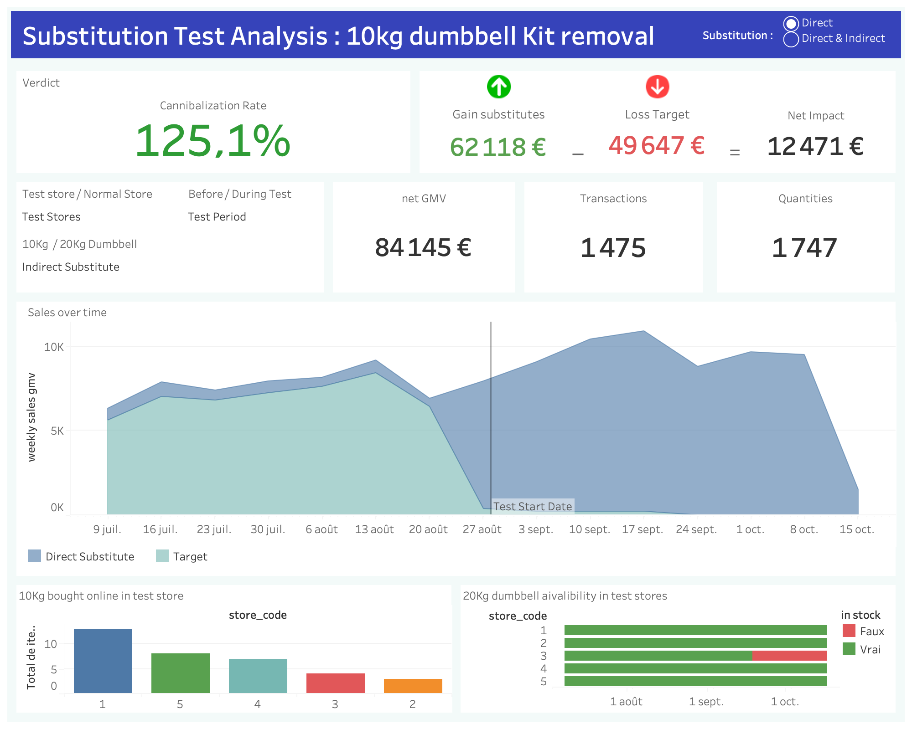
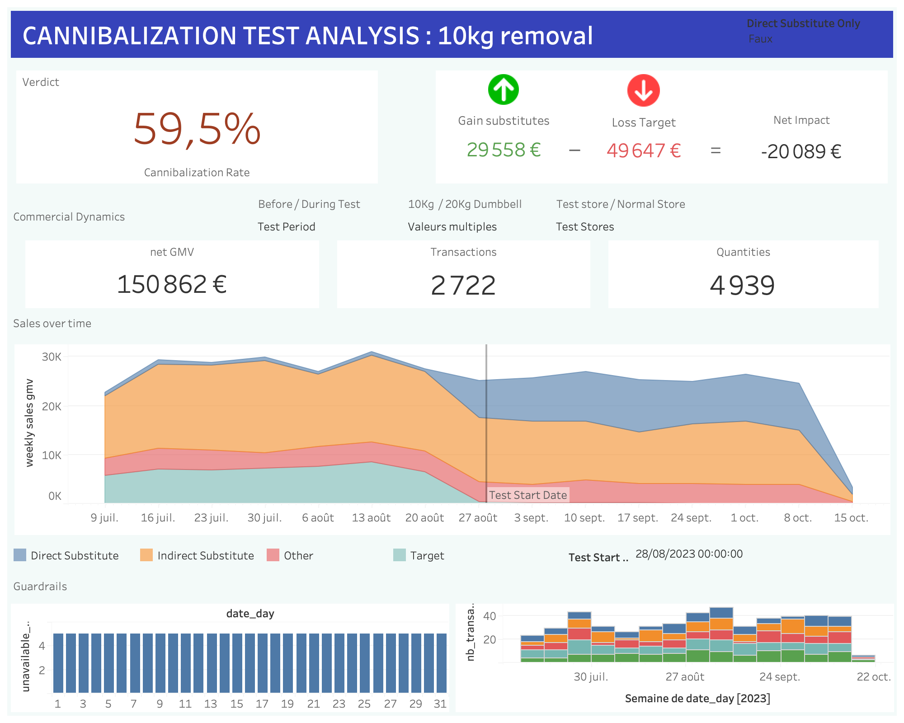

# Overview & Executive Summary

## 1. Executive Summary
The dashboard analysis reveals a critical duality in the results, illustrating the importance of properly defining the observation scope:

* **Local Success (Direct Cannibalization: 125%):** For the identified direct substitutes (20kg Kit, Discs), the bet pays off. For every €100 of revenue lost on the 10kg, we recovered €125 on these specific products. Customers accept the substitution.
* **Global Failure (Indirect Cannibalization: 59.5%):** However, at the full category level ("Weights"), the result collapses. Removing the 10Kgs Dumbbell kit appears to have reduced overall traffic or conversion on other ancillary products.
* **Recommended Decision:** **STOP.** Despite the success on the 20kg, the overall revenue loss on the category (-40.5% net on the impacted scope) makes removing the 10kg Kit economically dangerous at this stage.

## 2. Project Structure
To deliver this analysis, the repository is organized into three main components:

* **`README.md` (This Report):** The central documentation detailing the business logic, data modeling choices, and engineering best practices.
* **`dashboard.twb`Tableau Dashboard:** The visual, interactive "decision-first" interface designed for the Commercial Director.
* **`substitution_effect` (dbt Project):** The data transformation pipeline built with dbt to clean, join, and aggregate the raw data into a BI-ready semantic model.


---

*The following report details all the analytical steps, methodological choices, and technical decisions that were made to make this analysis possible.*
> **Note on Data Generation:** To build and test this data model, synthetic seed data was generated to create a representative sample mimicking real-world store behaviors, transactional patterns, and stock constraints over the test period.

# 1. Understanding and Analytical Strategy

## Context and Problem Statement
The Domyos brand conducted an "A/B Test" (or quasi-experimental) experiment during weeks 35 to 41 of 2023. The action consisted of removing the **10 kg dumbbell kit** from the shelves of a selection of "Test" stores.

The objective of this analysis is to validate the following economic hypothesis: **Does the removal of the 10 kg kit cause sufficient sales transfer (cannibalization) to substitute products (e.g., 20 kg kit, individual weight plates) to offset the revenue loss?**

To answer this question, we cannot simply look at raw sales figures. It is necessary to isolate the test's impact by comparing **Test** vs **Control** stores (not tested), while neutralizing external biases (stock-outs, customer returns).

## Key KPI Definitions

Important note : to make things simpler and more abstract, the 10Kg dumbbell kit will be referred to as the **"Target"**, the substitute products (20kg kit) as **"Substitutes"**, the indirect substitutes (weight plates) as **"Indirect Substitutes"** and the non-substitutes (yoga mat) as **"Other"**.

To drive this decision, I structured the dashboard around the following indicators:

* **Net GMV (Gross Merchandise Value):** The actual revenue generated.
    * Note : in the exercice document, **Gross Margin Value** is mentioned, but since we don't have COGS, we will use Net GMV as a proxy for revenue.
    * *Formula:* `SUM(GMV where type='sale') - SUM(ABS(GMV) where type='return')`
* **Substitute Gains:** The additional revenue generated by the substitute products during the test period.
    * *Formula:* `(Net GMV of Substitutes during test) - (Net GMV of Substitutes before test)`
* **Target Loss:** The revenue lost from the 10kg kit during the test period (baseline).
    * *Formula:*`(Net GMV of Target before test)`

* **Net Impact:** The overall financial result of the test.
    * *Formula:* `Substitute Gains - Target Loss`
* **Cannibalization Rate:** The key indicator of the study.
    * *Definition:* It measures the portion of the "10kg" loss that was recovered by "Substitutes". If the **rate is > 100%**, the test is beneficial.
    * *Formula:* `Cannibalization Rate (%) = Substitute Gains / Target Loss * 100`
* **Stock Availability:** Percentage of days when products were actually available for sale (`top_available_stock = True`).
* **Transactions & Quantities:** Volume indicators to verify if purchase dynamics change (average basket, traffic).

## Key Considerations and Methodological Choices
During data exploration, I identified 4 critical points that guided my modeling:

### 1. The "Gross Margin" vs "GMV" Nuance
The instructions ask to analyze "Gross Margin Value". However, the provided data does not contain the cost of goods sold (COGS) for products.
* **Decision:** I will drive the analysis on **Net GMV**. It is imperative to cross-reference these results with actual margin rates post-analysis to confirm final profitability.

### 2. Stock Management (Availability vs Sales)
The `fact_stock` provides information on stocks. Comparing raw sales between two stores is biased if one experienced stock-outs independent of the test.
* **Decision:** Stock will be used as a validity filter. If a product runs out of stock during the Test it will appear on the dashboard as a warning signal in the **Guardrails section**.

### 3. The "Online" Signal
Transactions marked as "Online" correspond to orders via the seller's app in-store. An abnormal increase in "Online" sales of the 10kg kit in "Test" stores would signal that the customer refuses substitution and forces the order, which is a critical insight.
* **Decision:** Online sales will be monitored through a custom visual in the **Guardrail section** of the dashboard. 

### 4. Data Quality (Returns)
The data contains operations of type `return`.
* **Decision:** To avoid artificially inflating revenue, GMV calculation will be net of returns.

# 2. Data Engineering Design Doc: Cannibalization Analysis Project

## 1. Context & Business Logic
The goal of this project is to model the economic impact of removing a specific product (**10kg Dumbbell Kit**) from shelves to measure the sales transfer to substitute products.
We also want to ensure that the observed effects are not due to external factors (stock-outs, returns, online orders) and have control group (for stores and products) to make sure the observed trends are not just seasonal or due to category-wide dynamics.

### Product categorization logic
To validate our substitution logic, we constructed a specific categorisation for `dim_model`. The challenge was to distinguish **Direct Substitution** (The product set to replace the target) from **Indirect Substitution** (product that might be indirectly affected by the suppression of the Target), and **Noise** (products that will be used as a control group).

**Mock Data Breakdown:**

| Item Code | Model | Product Name | Weight | Category | **Assigned Segment** | **Logic** |
| :--- | :--- | :--- | :--- | :--- | :--- | :--- |
| `1010` | 700 | **KIT HALTERE 10KG** | 10.0 | dumbbell kit | **Target** | The specific product removed from shelves. |
| `2020` | 800 | **KIT HALTERE 20KG** | 20.0 | dumbbell kit | **Direct Sub** | Upsell scenario (Higher price/margin). |
| `970069` | 1042303 | IRON DISC | 20.1 | weight plate | **Indirect Sub** | Indirectly impacted product. |
| `2232193` | 8388695 | DISC RUBBER 2.5kg | 2.5 | weight plate | **Indirect Sub** | Indirectly impacted products. |
| `3030` | 900 | TAPIS YOGA | 0.5 | yoga mat | **Noise** | Control group (completely unrelated). |

### Implementation: The Macro Approach
```sql

    case 
        -- 1. TARGET: The 10kg product
        when {{ model_name_col }} like '%10%' 
             and {{ product_nature_col }} = 'dumbbell kit' 
        then 'Target'

        -- 2. DIRECT: The 20kg product (Upsell)
        when {{ model_name_col }} like '%20%' 
             and {{ product_nature_col }} = 'dumbbell kit' 
        then 'Direct Substitute'

        -- 3. INDIRECT: Weight plates (Functional alternative)
        when {{ product_nature_col }} = 'weight plate'
        then 'Indirect Substitute'

        -- 4. OTHER: Control group products
        else 'Other'
    end

```
This helps us centrally manage the definition of a "Substitute".
---

## 2. dbt Architecture (Medallion)

> **Data stack used:** Dbt core with Databricks warehouse

### Staging (Silver)
* **Materialization:** `View` (Lightweight).
* **Key Transformation:** **Signed GMV**.
    * *Logic:* `CASE WHEN type = 'return' THEN -1 * abs(gmv) ELSE gmv END`.
    * *Benefit:* Allows downstream models to use simple `SUM(gmv)` without worrying about transaction types.

### Intermediate (Gold Preparation)
* **Materialization:** `Table` (Persisted for performance).
* **The "Fan Trap" Solution:** `int_sales_daily_stock`.
    * We pre-aggregate sales to the `Day/Store/Item` level *before* joining stock.
        * **Join Strategy:** `FULL OUTER JOIN` preserves days with stock but no sales (for availability calculation) and days with sales but missing stock info (for data quality audit).
* **Temporal Control Design:** Seed file `ref_test_periods` defines baseline (Weeks 28-34) and test period (Weeks 35-41).
    * **Column:** `test_period_type` in `mrt_kpi_dashboard`.
    * **Benefit:** Enables Before/After comparison to isolate test effect from seasonality.

### Marts (Gold)
* **Materialization:** `Table`.
* **Key Feature:** **Availability Filter**.
    * Column: `is_stock_valid_for_analysis`.
    * *Usage:* BI tools must filter on `True` to compare sales only when substitutes were physically available on shelves.

---

## 3. Optimization Opportunities

This part is only relevant if we were to extend this pipeline to a production environment for ongoing monitoring of experiments or sales performance. For this specific historical analysis, the current design is sufficient.
### A Incremental Models
* **Use Case:** **if** `int_sales_daily_stock` is a heavy model that aggregates transaction-level data.
* **Incremental Strategy:** We *could* configure it as an **Incremental Model** with `unique_key=['store_code', 'item_code', 'transaction_date']` and an incremental strategy (e.g., `merge` or `insert_overwrite`).
But since this analysis focuses on a **fixed historical window** (weeks 35-41 of 2023), incremental processing provides limited value in this specific case. However, if this pipeline were extended to monitor ongoing experiments or continuous sales data, it could be interesting.

### B Databricks Specific Optimizations

We could leverage **Liquid Clustering** to improve the table performance.

| Layer | Model | Clustering Keys | Rationale |
| :--- | :--- | :--- | :--- |
| **Intermediate** | `int_sales_daily_stock` | `['store_code', 'item_code']` | **Join Optimization:** These are the keys used for the heavy Full Outer Join. Co-locating data minimizes network shuffle. |
| **Mart** | `mrt_kpi_dashboard` | `['store_code', 'item_code', 'date_day']` | **Filter Optimization:** Optimized for BI dashboards filtering by Store or Product. |

---

## 4. CI/CD & Workflow

We implement a robust CI/CD pipeline (e.g., GitHub Actions / GitLab CI) to ensure code quality before production.

### The Flow
1.  **Feature Branch:** Developers work on `feat/new-kpi`.
2.  **Pull Request (PR):** When opening a PR to `dev`:
    * **Linting:** SQLFluff checks coding standards.
    * **Slim CI:** We run `dbt run --select state:modified+`. This only builds the models that changed and their downstream dependencies, saving compute time.
3.  **Regression Testing:** `dbt test` must pass on the modified models.
4.  **Merge to Prod:** If the `dev` tests pass, a user can promote the branch to prod and the full pipeline runs for `prod`.

### Environment Management
* **Dev:** Schema `dev`. Used to check the result before promoting to prod.
* **Prod:** Schema `prod`. 

---

## 5. Testing & Quality Assurance

### Test considerations
There are two main types of tests : 
* Testing if the data coming to our model is correct 
* Testing the data coming out of our model is correct and makes sense (business checks)

> Because we are not owner of the data source, and our output is a critical business dashboard, we need both kind of tests.
### Business Checks with dbt Tests
* Ensuring that critical business rules are respected (e.g., `10Kg dumbbell` should not be available in the test stores during the test).
### Technical Checks with dbt Tests

1.  **Generic Tests:** Uniqueness and Not Null constraints on all Primary Keys in `schema.yml`.

2.  **Relationship Tests:**
    * Foreign key integrity checks to ensure referential consistency between staging and intermediate layers.
3.  **Custom Data Tests:**
    * **Expression validation:** `dbt_utils.expression_is_true` to verify business rules (e.g., "daily_net_gmv IS NOT NULL OR is_available IS NOT NULL" on `int_sales_daily_stock`).
    * **Range validation:** `dbt_utils.accepted_range` to ensure numeric fields like `stock_days_available`, and `stock_days_expected` have logical values (e.g., >= 0).
    * **Accepted values with conditions:** Testing categorical fields like `transaction_channel_type` are within values Offline and Online.
    * **Unique combination tests:** `dbt_utils.unique_combination_of_columns` to validate composite primary keys (e.g., `store_code + date_day + cannibalization_segment` on `mrt_kpi_dashboard`).
4.  **Singular Tests (Business Logic):** * `assert_cannibalization_target_is_unique.sql`: Ensures our `LIKE '%10KG%'` logic is precise enough to capture exactly **one** item code as the Target. If it captures 0 or >1, the pipeline fails.

### Advanced Data Quality
To further harden the pipeline, we can consider two enhancements:

#### A. Elementary or Great Expectations integration
While `dbt test` is great for test ting data, GE is better for monitoring data quality over time and detecting anomalies. For instance we could check that the sale values are within expected ranges based on historical data:

```python
    # Expect the daily total GMV to be within 20% of the 30-day rolling average
    validator.expect_column_values_to_be_between(
        column="daily_net_gmv",
        min_value=0,
        max_value=10000 # Threshold based on historical max
    )
```

#### B. dbt Snapshots (SCD Type 2)
Currently, `dim_model` is a Type 1 dimension (overwritten).
* *Problem:* If the `product_weight` of an item changes (e.g., from 10kg to 10.5kg) or changes name, we lose history.
* *Solution:* Implement `snapshots/snp_dim_model.sql`.

# 3. Dashboard Design & Interpretation

## Design: "Decision-First"
The goal of this dashboard is to allow the Commercial Director to validate or reject the product removal hypothesis in less than 10 seconds. The interface is structured according to a pyramidal logic (Top-Down): from the overall financial verdict to the detailed analytical explanation all the way to guardrails to make sure the data is reliable.

## Indicator Architecture

### 1. The Verdict (Header & Financial Impact)
This is the critical zone located at the top of the dashboard. It immediately answers the question: *"Is it profitable?"*.
* **Cannibalization Rate (%):** The master KPI. It represents the revenue recovery ratio.
    * *Reading:* If > 100%, the sales transfer to substitutes (20kg, discs) exceeds the loss from the 10kg.
* **Net Impact Bridge (€):** A simple visual equation to explain the financial mechanics:
    * **Substitute Gain** - **Target Loss** = **Net Result**
The **Substitute** toggle on top is **crucial**. It helps filters the entire dashboard between "Direct Substitution" (20kg only) and "Indirect Substitution" (20kg + Discs). This allows us to understand if the transfer is happening only on the direct substitute or if it also benefits/hurt the broader category.

### 2. Commercial Dynamics (Business Context)
This section helps understand *how* the result is obtained, through the 3 requested metrics:
* **Net GMV:** Overall business volume (net of returns).
* **Quantities Sold:** Allows verification of whether the transfer occurs in equivalent volumes or if fewer units are being sold (risk of traffic loss).
* **Transactions Count:** Sames as above, but less granular because transactions can include multiple items. A drop in transactions with stable quantities could indicate a change in customer behavior (e.g., customers buying more substitutes per visit).

### 3. The Visual Proof (Temporal View)
* **Stacked Area Chart:** A temporal visualization (Weeks 28-41) comparing "Test" vs "Control" sales curves.
* **Objective:** Visualize the trend break at the test launch (Week 35) and confirm that the increase in substitutes is indeed correlated with the removal of the 10kg.

### 4. Quality Guardrails (Reliability)
To ensure intellectual honesty in the analysis, two contextual indicators are displayed in the footer:
* **Stock Availability Rate:** If substitute stock (20kg) is low (<90%), the test is invalidated because sales transfer is physically impossible.
* **Online In-Store Share:** Monitors the rate of orders via eller's app. An abnormal increase would signal customer friction (the customer "forces" the purchase of the unavailable 10kg).

## Dashboard Mockup
### Direct Substitution Dash :

### Indirect Substitution Dash :

## Analysis & Recommendation: The Verdict

The dashboard analysis reveals a critical duality in the results, illustrating the importance of properly defining the observation scope:
* **Local Success (Direct Cannibalization: 125%):** For the identified direct substitutes (20kg Kit, Discs), the bet pays off. For every €100 of revenue lost on the 10kg, we recovered €125 on these specific products. Customers accept the substitution.
* **Global Failure (Indirect Cannibalization: 59.5%):** However, at the full category level ("Weights"), the result collapses. Removing the 10Kgs Dumbbell kit appears to have reduced overall traffic or conversion on other ancillary products.
* **Recommended Decision:** **STOP.** Despite the success on the 20kg, the overall revenue loss on the category (-40.5% net on the impacted scope) makes removing the 10kg Kit economically dangerous at this stage.

# 4. Next Steps & Industrialisation

Cette analyse initiale permet de visualiser les tendances. Pour passer à l'industrialisation et à la validation scientifique rigoureuse, je recommande les étapes suivantes.

## 4.1. Statistical Validation (Rigorous A/B Testing)
The current dashboard is descriptive. To confirm that the observed variations are not due to chance, we must formalize the statistical test.

### Hypotheses
* **Test Type:** "Two-sample t-test" (comparison of means) or ideally a **Difference-in-Differences (DiD)** method to neutralize historical biases between Test and Control stores.
* **Null Hypothesis ($H_0$):** The removal of the 10kg product has **no positive impact** on the overall GMV of the category ($\mu_{test} - \mu_{control} \le 0$).
* **Alternative Hypothesis ($H_1$):** The removal generates sufficient sales transfer to maintain or increase GMV ($\mu_{test} - \mu_{control} > 0$).

### Sample Size
To statistically validate this test in the future, we must define the sample size (number of stores/days) required upfront.
In a fast-paced Retail context ("Fail Fast"), I recommend a **Confidence Level of 80%** ($\alpha = 0.20$) rather than the academic standard of 95%, in order to accelerate decision-making.

**Calculation Formula (Evan Miller / Cohen's d):**

$$n = \frac{2\sigma^2(z_{\alpha/2} + z_{\beta})^2}{\delta^2}$$

*Where:*
* $n$ = Required sample size per group.
* $\alpha = 0.20$ (Accepted risk of false positive).
* $1-\beta = 0.80$ (Statistical power: probability of detecting an effect if it exists).
* $\delta$ (Delta) = The minimum detectable effect (e.g., we want to detect at least +2% GMV).
* $\sigma$ (Sigma) = The historical standard deviation of sales (variance).

## 4.2. Databricks Optimizations
Beyond partitioning and Liquid Clustering (already integrated into the model), industrializing this pipeline will require:

1.  **Delta Live Tables (DLT) & Expectations:**
    * Implementation of strict quality constraints (e.g., `CONSTRAINT valid_gmv EXPECT gmv > 0`, `EXPECT stock_boolean IS NOT NULL`), ensures the pipeline block corruped data from getting to the dashobard.

2.  **Materialized Views:**
    * Let's say our final model was a sanitize view, Rather than recalculating complex aggregations each time the dashboard opens, we will create a Materialized View in Databricks SQL. Saving a lot of compute time and cost.

3.  **Serverless SQL Warehouses:**
    * Using Serverless compute greatly helps reduce costs.

## 4.3. Towards "AI-Driven Analytics" (LLM-Ready)
To anticipate future needs for natural language querying (Text-to-SQL) by business teams, the data model must be exposed through a **Semantic Layer**.

The goal is to transform technical documentation into business context for an LLM (such as Databricks Genie or an internal RAG agent).

1.  **Leveraging dbt Metadata as Context:**
    * Column descriptions in dbt's `schema.yml` could be easily reused as a it gives a lot of context and metadata on the model

2.  **Semantic Layer Structure:**
    * Use a OBT (One big table) design. It will simplify the data model and improve query performance. Rather than letting the AI generate complex `JOIN`s on the fly (a source of errors)

3.  **AI Text-To_SQL Tool (Databricks Genie):**
    * By coupling this metadata (Unity Catalog) with a tool like **Databricks Genie**, we will enable the Commercial Director to explore "Long Tail Questions" (ad-hoc questions not anticipated in the dashboard) autonomously, with the guarantee that the AI respects the semantics defined by the Data team.

